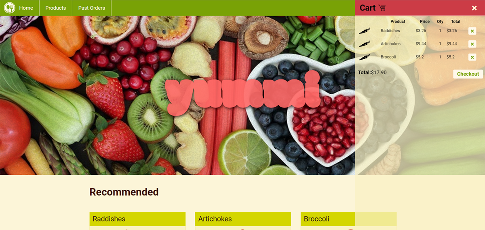

# FreeCodeCamp and Gwendolyn Faraday Vue3 Course

 

Gwendolyn Faraday developed this course. She previously created one of the most popular Vue courses on the entire  
internet and now she's back with this updated course. In the course, you can learn the fundamentals of VUE and apply
what you learn to build an e-commerce website.

### Here are the sections in this course:

- What is Vue.js?
- Vue 3 Setup
- Vue JS Directives
- Events and Methods
- Components
- Component Props
- Lifecycle Hooks
- App Demo
- Adding Items to Cart
- Reuseable Components
- Vue CLI
- Vue Folder Structure
- Top Nav
- Styling with SASS
- Sidebar
- Adding Items to Cart

Watch the full course below or on the freeCodeCamp.org YouTube channel (4-hour watch).
https://youtu.be/FXpIoQ_rT_c